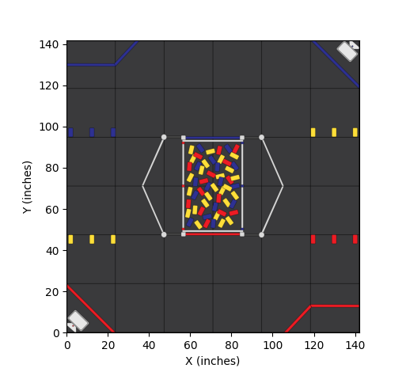

Black Ice is a **Reactive Path Follower** developed by __FTC Team #18535__, Frozen Code. It is designed to provide more simple, efficient, effective path following by **predicting real-time, directional braking distance**. Unlike traditional path-following libraries that gradually slow the robot down, Black Ice dynamically calculates the optimal braking distance based on the robot’s current speed. This allows the robot to maintain full power for as long as possible, only beginning to brake at the precise moment needed. By predicting the robot's position in real time, the robot can also navigate curved paths with greater precision, minimizing overshooting.

and high-speed

Unique, key features:
- Zero Manual, Arbitrary Tuning
- Modular Customization
- Bezier Curves

Black Ice is tailored for teams with odometry wheels looking for simple, high-speed path execution with the option of modular customization.

# Usage
### Requirements: Odometry Wheels / Pinpoint Odometry Processor
Black Ice intentionally uses the the slippage of the wheels in order to stop faster. This requires separate dead wheels in order to not get off.

## Initializing at start of OpMode
```java
Follower.init(this);
```

## Simple Point-to-Point Movements
All of these methods are blocking, meaning they wait until the robot has reached its position.
If you want non-blocking methods or want to incorporate hardware during movements see [link](#More-Advanced-Modular-Movements).
Moving the robot to a point and stop:
```java
// Moves the robot 24 inches in the y direction at a heading of 90 degrees and stops.
Movement.stopAtPosition(0, 24, 90);
```


Moving the robot through a point:
```java
// Moves the robot 12 inches in x direction and 24 inches in the y direction at a heading of 0 degrees
Movement.moveThrough(12, 24, 0);
```

## More Advanced Modular Movements
```java
// Moves the robot 24 inches in the y direction at a heading of 90 degrees and stops. When the linearSlide is lowered it will turn off the power. Passing an argument into `.waitForMovement` is optional but if you do it will run the function every loop.
new Movement(0, 24, 90)
    .stopAtPosition()
    .waitForMovement(() -> {
        if (linearSlide.isLowered()) {
            linearSlide.setPower(0);
        }
    });
```

## Following Paths
### Bezier Curves

### Lines

current velocity divided by maxVelocity

TODO feautes +Kv = 1/maxVelocity +Kstatic minimum amount to move
Autotuning constants
Autotuning braking distance over time

## Why Did We Develop Black Ice?
- To intuitively learn, hands-on, how path following works in robotics. We encourage users to experiment by creating their own correction functions or adding new features.
- To explore more efficient and simpler solutions
- To minimize the tuning process and reduce complexity
- To have more modular customization

### We Encourage *You* to Make Your Own Movement System
We developed Black Ice to intuitively learn, hands-on, how path following works in robotics. We encourage users to do the same by experimenting with their own correction functions or adding new features. We designed Black Ice very modular in order to easily change the path-following algorithms.

Here are some ideas for new features:
- Try following paths using derivatives (functions that give you the slope of a curve at any point) of the bezier curves. This may have to be combined with a translational correction to stay on the path. This is what Pedro Path uses, however they do not incorporate braking distances.
- Implement a better target velocity algorithm.
- Implement feedforward system.

# How Does Black Ice Work?

## Predicting the Directional Braking Distance
Black Ice has 2 automatic tuning opModes (one forward/backward and one lateral) that makes the robot travel at different velocities. Once it reaches a certain velocity, it sets the power to 0 with zero power brake mode on. This locks the wheels and makes the robot stop. It then calculates the distance it took the robot to stop. Once it gets a certain amount of points it uses a quadratic regression algorithm to derive a quadratic formula that predicts the robot's braking distance at any velocity.
We use the constants it gives and plug it into a signed-quadratic function (which means that works in both positive and negative numbers). [x is the xVelocity or yVelocity]
$$
f(x) = \text{sgn}(x) \cdot a \cdot x^2 + b \cdot x + \text{sgn}(x) \cdot c
$$
```java
public double predict(double x) {
    double sign = Math.signum(x);
    return (sign * a * Math.pow(x, 2)) + (b * x) + (sign * c);
}
```

## Stopping at a Position
`(error - predictedBrakingDistance) * constant`
`targetPosition - (currentPosition + predictedBrakingDisplacement)`
The braking distance is calculated in real time and the numbers can be negative. The robot will travel at maximum speed until the braking term overpowers the error. This will make the robot stop

## Following Paths
Black Ice traces out points on a Bezier Curve for the robot to follow. This forces the robot to follow the exact path.
The robot drives at full power towards these points. It knows whether it is past a point if the robot's predicted position is past the plane perpendicular to the line between the two points. 


By having the robot follow points, this forces the robot to follow the path. Using dervivates like pedro paths adds complexity and adds transitional correction.

Support for Bezier Curves

HIgh proportianl
Black Ice is a efficient and effective dynamic path follower developed by Team #18535, Frozen Code, in the 2025 season and offseason.

How is ours is different from others like Roadrunner and Pedro Path? The key difference is that Black Ice calculates braking distance by having the motors on zero power brake mode. Other libraries, calculate drift distance by having the motors on zero power float mode. Our framework uses the braking distance to predict where the robot will be next, allowing it to maintain full speed until it reaches an optimal braking point, minimizing unnecessary slowing while ensuring precise stopping.

We have just one tuning test that runs the robot at different velocities to brake and calculate the braking distance. With those data points, we used quadratic regression (since stopping distance is proportional to velocity squared) to derive a function that accurately predicts the required braking distance at any speed.

Our drive power formula is purely proportional, subtracting the predicted braking distance from the target position. No arbitrary constants are needed. No integral term is needed, as stationary robots have zero braking distance. No derivative term is required either, since braking distance naturally adjusts to slow the robot precisely when needed.

# Credits
All code developed by Jacob Ophoven with help of Coach Andy and members of the FTC community.
Early Discord Supporters: alexreman45


Smoother Transitions: Ensuring less jerky motions for precision-intensive tasks.
Faster Execution: Reducing time spent in path planning and execution.
Dynamic Adjustments: Reacting to obstacles or changes in the environment in real-time.